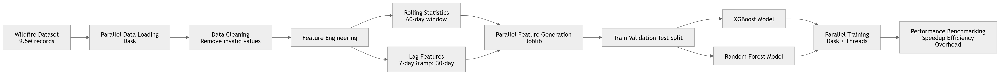

# High-Performance Wildfire Risk Prediction: A Parallel Computing Approach
## Overview

Wildfire ignition prediction is an important challenge in environmental safety and disaster prevention. Increasing wildfire frequency due to climate change has made predictive analytics a critical tool for early warning systems and resource planning.

This project demonstrates how High-Performance Computing (HPC) techniques can accelerate wildfire prediction pipelines by parallelizing data processing, feature engineering, and model training on a large-scale meteorological dataset.

Using the FireCastRL US Wildfire Dataset, which contains 9.5 million daily observations across 37,000+ locations in the United States, we implement and benchmark multiple parallel computing frameworks including Dask, Joblib, and built-in multithreading in machine learning libraries. 

The goal is not only to build predictive models, but also to analyze computational speedups, efficiency, and scaling behavior under different CPU configurations.

## Key Objectives

This project focuses on three major objectives:

1. Computational Optimization - Parallelize temporal feature engineering and model training using multiple cores to reduce computation time.
2. HPC Theory Validation - Validate Amdahl’s Law by measuring theoretical vs observed speedup in parallel workloads.
3. Parallel Machine Learning - Benchmark different parallel training strategies for tree-based models including:
- XGBoost
- Random Forest

These models are evaluated under several parallel computing frameworks.

## Dataset
### FireCastRL US Wildfire Dataset

- Source: Kaggle FireCastRL Lab
- Size: 9.5 million records
- Time span: 2013 – 2025
- Spatial coverage: 37,098 unique locations across the continental US

Each record contains:
- meteorological variables
- fuel moisture indices
- atmospheric indicators
- wildfire ignition label

Examples of features include:
- Temperature (tmmn, tmmx)
- Humidity (rmin, rmax)
- Precipitation
- Wind speed
- Vapor pressure deficit
- Energy Release Component
- Burning Index
- Fuel moisture indices

The target variable is Wildfire ignition (binary classification).

## System Architecture

The project pipeline follows a typical HPC-enabled machine learning workflow.

```declaration
Raw Wildfire Dataset
        │
        ▼
Parallel Data Loading (Dask)
        │
        ▼
Feature Engineering
60-day rolling statistics + lag features
(Joblib Parallelization)
        │
        ▼
Model Training
XGBoost / Random Forest
        │
        ▼
Parallel Hyperparameter Search
(Joblib CV / Dask)
        │
        ▼
Performance Benchmarking
Speedup | Efficiency | Overhead
```
## HPC Pipeline Architecture



## Parallel Computing Frameworks
### Dask

Used for distributed data processing and model training.

Applications in the project:
- Parallel CSV loading
- Distributed XGBoost training
- Distributed Random Forest via Joblib backend

Dask uses a scheduler-worker architecture where tasks are distributed across multiple workers.

### Joblib

Used for parallel execution of independent tasks.

Applications include:
- Rolling feature computation
- Hyperparameter search
- cross-validation

Joblib creates process pools or thread pools to distribute workloads across cores.

### Built-in Library Parallelism

Tree-based models contain internal multi-threading.

Examples:
- XGBClassifier(n_jobs=k)
- RandomForestClassifier(n_jobs=k)

These implementations parallelize tree construction and feature split evaluation.

## Feature Engineering

The project generates temporal rolling statistics for weather variables.

For each location’s time series:
- 60-day rolling mean
- 60-day rolling standard deviation
- 60-day rolling maximum
- 60-day rolling minimum
- 7-day lag
- 30-day lag

Applied to 10 meteorological variables, resulting in:

        10 variables × 6 engineered features = 60 new features

Because the dataset contains tens of thousands of locations and years of daily data, rolling feature generation requires billions of operations, making it a computational bottleneck.

## Machine Learning Models
### XGBoost
- Gradient boosted decision trees
- Histogram-based tree construction
- Optimized for parallel training

Key parameters:
- max_depth = 8
- learning_rate = 0.08
- n_estimators = 300
- subsample = 0.8
- colsample_bytree = 0.8

### Random Forest
- Ensemble of bagged decision trees
- Highly parallelizable because trees are independent

Configuration:
- n_estimators = 300
- max_features = sqrt
- bootstrap sampling enabled

## Data Preprocessing

Several preprocessing steps were applied:

### Data Cleaning

Removed invalid sentinel values from weather datasets.

### Feature Selection

Reduced dataset from 19 to 14 essential features.

### Temporal Features

Extracted:
- year
- month
- day of year

### Class Imbalance Handling

Wildfire events are rare.

Original dataset: 5.3% fire events <br>
Training dataset adjusted to: 15% fire events

to improve model training.

## Train / Validation / Test Split

Chronological splitting was used to avoid data leakage.

| Dataset    | Time Period |
| ---------- | ----------- |
| Train      | 2014 – 2021 |
| Validation | 2022 – 2023 |
| Test       | 2024 – 2025 |

## Parallelization Results
### Rolling Feature Engineering

| Cores | Time (s) | Speedup   |
| ----- | -------- | --------- |
| 1     | 417      | 1.0×      |
| 16    | 93       | 4.48×     |
| 32    | 59       | 7.04×     |
| 50    | 42       | **9.72×** |

Observed speedup closely matched theoretical limits predicted by Amdahl’s Law.

### Hyperparameter Search

| Cores | Speedup |
| ----- | ------- |
| 4     | 3.84×   |
| 8     | 5.76×   |
| 16    | 9.39×   |

Large training tasks resulted in excellent parallel efficiency.

## Model Performance

| Model         | Accuracy | ROC-AUC | Training Time |
| ------------- | -------- | ------- | ------------- |
| XGBoost       | 0.617    | 0.576   | ~42 seconds   |
| Random Forest | 0.664    | 0.554   | ~210 seconds  |

XGBoost achieved faster training while Random Forest showed better scaling across cores.

## HPC Insights

Several important HPC lessons emerged:

### Task Size Matters
Large tasks (model training) parallelize much better than tiny tasks (per-location processing).

### Amdahl’s Law Limits Speedup
Sequential portions of the algorithm limit maximum achievable speedup.

### Algorithm Structure Affects Scalability
- Random Forest scales extremely well due to independent trees.
- XGBoost has sequential boosting steps that limit scaling.

### Framework Selection is Critical
- Joblib works best for CPU-bound Python tasks
- Dask excels for distributed workloads
- Built-in threading often provides the most efficient scaling on a single machine.

## Repository Structure

```declaration
wildfire-risk-prediction-parallel-computing
│
├── src
│   └── HPC_TEAM10.ipynb
│
├── document
│   ├── TEAM_10_Report_HPC.docx
│   └── HPC_TEAM10.pptx
│
├── README.md
└── requirements.txt
```

## Technologies Used
- Python
- Dask
- Joblib
- XGBoost
- Scikit-learn
- Pandas
- NumPy
- Matplotlib

## Future Improvements

Potential future work includes:
- GPU-accelerated model training
- multi-node distributed clusters
- SHAP explainability analysis
- advanced imbalance handling
- concept drift detection

## References

- FireCastRL Lab – US Wildfire Dataset
- Amdahl, G. (1967) Parallel computing theory
- Chen & Guestrin (2016) XGBoost
- Pedregosa et al. (2011) Scikit-learn
- Rocklin (2015) Dask
